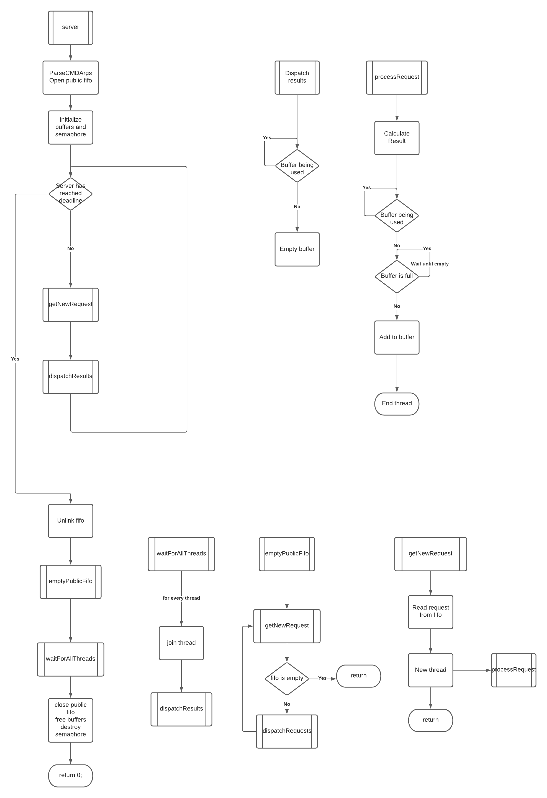

# **Application Server**

For this project's second part, the main goal is to create an application able to manage and execute orders between a client and a server. 
So, in order to accomplish this task, we needed to use multithreaded programms and FIFOs, and to avoid conflicts between the entities envolved.
This way, client C's ordered tasks are are calculated on a library B (extern), executed by a server S which accepts those orders and returns their results.
Firstly, at an initial stage, it was intended to work with a Client C component, assuming that the server (FIFO) is already implemented. Therefore, taks's orders are sent to that server by a process (multithread) and saved on a queue until it is their turn. Then, they are transfered to B and their results are stored in a buffer. Consider that this buffer works as a warehouse, monitorized by a consumer thread, which sends the results, one by one, to C.

# **Compilation**

To compile simply do make on the src folder.
> make
 
# **Running**

In order to use the client, we need to have the server running aswell.

**Client**

To run the client, call the executable, followed by the running time (seconds) and the public fifo name.
For example.
> ./c -t 1 aFifo

In a more general way

> ./c -t <-nsecs> <-fifoname>
 
**Server**
 
To run the server, call the executable, followed by the running time (seconds), size of the buffer and the public fifo name.
For example.
> ./s -t 1 -l 1000 aFifo

In a more general way

> ./s -t <-nsecs> [-l <-bufferSize>] <-fifoname>
    
# Client 

## **Errors and input**

There must always be exactly 4 arguments (including the program call).

Failure to provide a valid flag (-t) or time will yield an error.

Failure to provide a name for the fifo will yield an error.
  
## **Implementation**
  
1. Parse the command arguments
2. Synchronize with the server
3. Generate requests by creating request threads and sending them through the public fifo
4. Create private fifo and wait for the response from the server, which will be sent through this newly created channel.

During this steps, the client will also register operations such as:
* Client request thread makes initial request (IWANT)
* Client request thread acknowledges the arrival of the response from the server (GOTRS)
* Client request thread informs that the request was rejected, because the server was closed (CLOSD)
* Client request thread informs that he can no longer wait for the answer (GAVUP)

# **Server**

## **Errors and input**

There must be either 4 or 6 arguments, without or with buffer size specification (including the program call).

Failure to provide a valid flag (-t) or time will yield an error.

Not providing a buffer size will make it have a default value.
Buffer size can be specified by doing -l bufferSize after the server's time of execution

Failure to provide a name for the fifo will yield an error.

## **Implementation**

1. Parse the command arguments
2. Create the fifo for the client's use
3. Create the thread and responses buffer and init the semaphore
4. While the server has not passed its execution deadline
    1. Read from the public fifo getting a new request
       + Register RECVD
    2. Create a new thread to process that request
        + The thread will calculate the result and register TSKEX
        + Then, if the buffer is not being used by another thread, add it to the buffer. If the buffer is full, it will wait until that is no longer the case
    3. Dispatch all requests that have been stored
5. After the server has passed the execution deadline
    1. Unlink the public fifo so the client can no longer make requests
    2. Empty the fifo of any requests that might be remaining. This will be identical to point 4 with the difference that TSKEX won't be issued
    3. Wait for the conclusion of any possibly running thread. After joining a thread, the result should be dispatched 
   
Dispatching requests will involve fetching them from the buffer. Therefore, the semaphore is locked during this time.
Afterwards, the number of requests stored in the buffer is reset to 0.
When dispatching a request there are three options:
+ The private fifo is closed -> Register FAILD
+ The response of the request is -1. This means that the request was received after the servers deadline -> Register 2LATE
+ Everything was successful -> Register TSKDN

 # **Self-evaluation**
  
Henrique Sousa up201906681: 25%

Domingos Santos up201906680: 25%

Bruno Rosendo up201906334: 25%

João Mesquita up201906682: 25%
